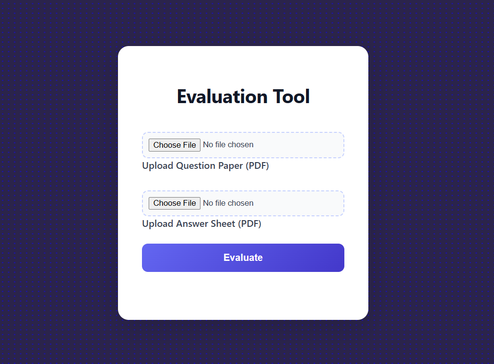
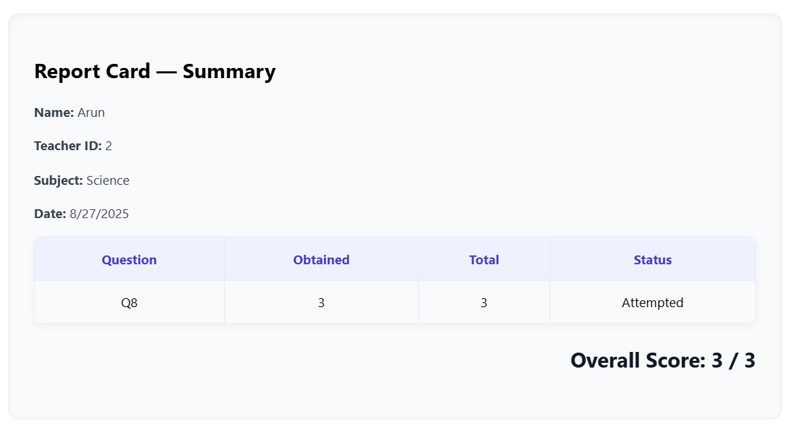
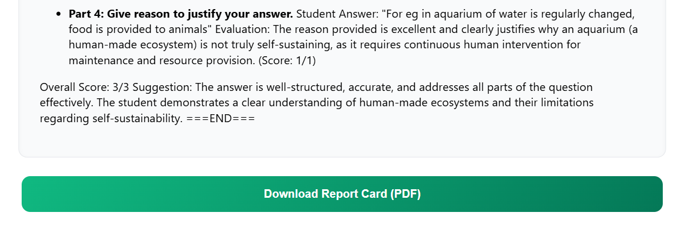

# 📝 Smart Evaluation Tool for Teachers

**Tagline**: AI-powered evaluation tool that grades **handwritten question & answer PDFs** in real-time.

## 🚀 Overview
This is a **full-stack web application** that helps teachers quickly evaluate student responses.  
It accepts **handwritten question papers** and **handwritten answer sheets** in PDF format,  
automatically grades them, and provides **detailed feedback + a downloadable report card**.

## 📂 Demo & Testing

We’ve included **sample PDFs** for quick testing: (Download and upload them)

- [`/samples/ans.pdf`](./samples/ans.pdf) → Example handwritten **answer sheet**  
- [`/samples/quest.pdf`](./samples/quest.pdf) → Example **question paper**

## 📸 Demo Screenshots  

**Upload Section**  
  

**Evaluation Result**  
  

**Report Card PDF Download**  
  

## ✨ Features
- 📄 **Upload handwritten question & answer PDFs** for evaluation  
- ⚡ **Automatic grading & scoring** with per-question breakdown  
- 💬 **Instant feedback & improvement suggestions**  
- 📊 **Overall score calculation** with attempted/unattempted status  
- 🌐 **REST API** for programmatic evaluation  
- 💻 **Clean, responsive React frontend** with real-time updates  

### 🛠 How to Test
1. Start the frontend (`npm run dev`) and backend (`uvicorn main:app --reload`).  
2. Upload the provided **`question.pdf`** and **`answer.pdf`**.  
3. Click **Evaluate** → get instant grading + feedback.  
4. Download the generated **Report Card (PDF)**.

## 🛠 Tech Stack
- **Frontend**: React (Vite), TypeScript, TailwindCSS  
- **Backend**: FastAPI (Python), Uvicorn  
- **AI & ML**: Google Gemini (evaluation & scoring)  
- **OCR**: Microsoft Azure Cognitive Services (for handwritten text extraction)   
- **Deployment**: Render (backend), Vercel / Netlify (frontend)  

---
